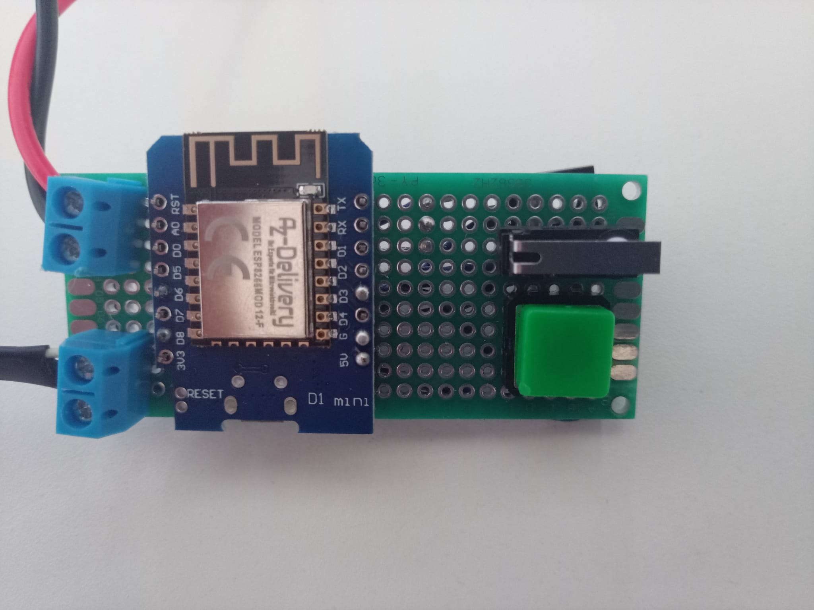
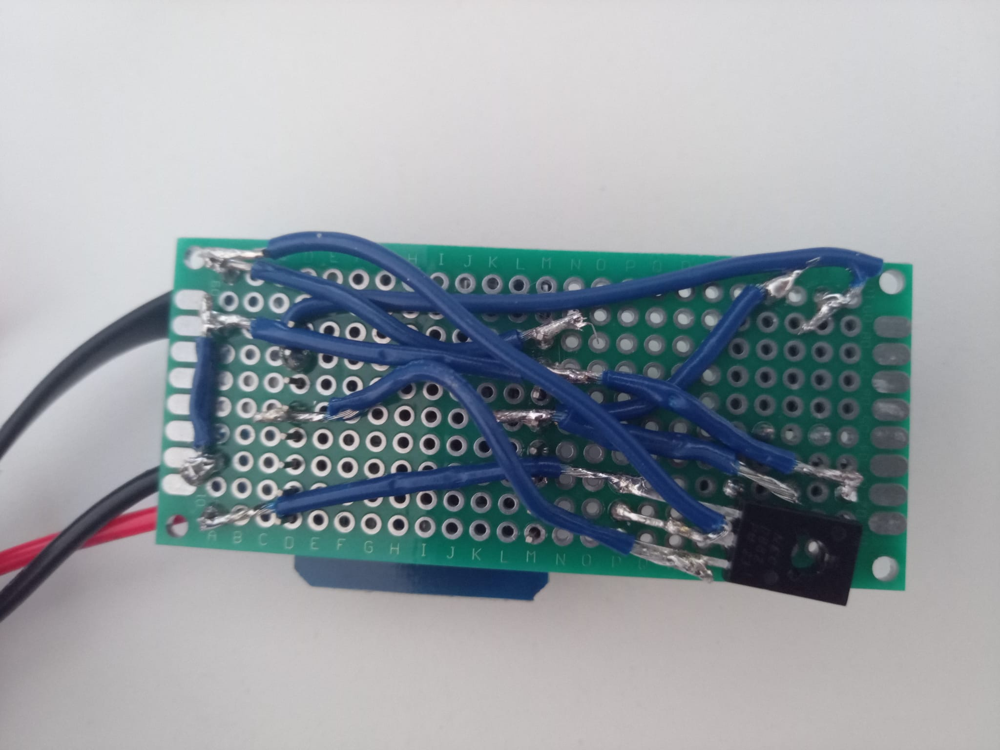

# HPA FCU

This project represents a custom FCU for HPA engines with one valve.

## Material

- 1x [ESP8266 / D1 Mini](https://www.az-delivery.de/collections/esp8266/products/d1-mini)
- 2x Buttons
- some cable

## Required devices

- Soldering iron

## Assembly

|  |  |
| ---------------------------- | ---------------------------------- |
| top view                     | bottom view                        |
